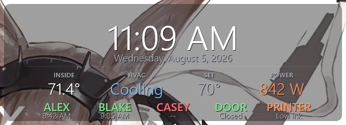

# Rainmeter × Home Assistant

Two Rainmeter skins driven by Home Assistant, with no access token stored on the desktop.

**HA Now Playing** — album art, title and an artist line tinted with a colour picked from the artwork, for *whatever* is playing in HA. Music Assistant, Spotify, Sonos, Cast, Plex, Jellyfin, an AirPlay receiver — anything that is a `media_player`.


**HA Status Board** — a clock with two configurable rows underneath: up to 4 **stats** (a label over a value) and up to 6 **chips** (a coloured name over a sub-line). Nothing in the skin knows what a thermostat is — the screenshot below happens to show temperature, HVAC, setpoint and power draw over three people, a door and a printer, but every slot is just a string you build in YAML. Empty slots hide themselves, empty rows collapse, and the panel height follows.



They are designed to share a screen — same panel fill, corner radius and shadowed text — and to place themselves at the bottom-left and top-centre of any resolution without hardcoded coordinates. Both panels are translucent, so the wallpaper showing through the screenshots above is just a desktop, not part of the skin.


## Why it works this way

The obvious design is to have Rainmeter call the Home Assistant REST API. That needs a long-lived access token, and a Rainmeter skin is a plain text file in the user's Documents folder — on a shared or public-facing machine that is a token waiting to leak.

So the data flows the other way. Home Assistant writes two small files into its own `www/` folder, which it serves at `/local/` **without authentication**, and Rainmeter just reads them:

```
Home Assistant  ──►  www/nowplaying.json      ──►  Rainmeter WebParser
                     www/nowplaying_cover.png
                     www/statusboard.json
```

Nothing secret is stored on the desktop and nothing secret is exposed: those files contain only what is already on the screen. The trade-off is real and worth stating plainly — anyone who can reach your HA host can read `/local/`, so treat the current track and the presence board as public within your LAN. If that is not acceptable, put HA behind auth for `/local/` and this project is not for you.

A side benefit: because HA is the source, the now-playing panel is correct no matter *who* is casting. Skins that read the local Windows media session only ever see the person logged into that PC.

## What's here

```
homeassistant/
  scripts/nowplaying.py        fetches artwork, picks the accent, writes the JSON
  scripts/write_json.py        generic "render a template into www/" file writer
  packages/*.yaml              drop-in HA config: source picker, sensors, refresh
skins/
  HANowPlaying/                the now-playing panel
  HAStatusBoard/               the clock / climate / presence panel
docs/
  install.md                   step-by-step setup
  sources.md                   per-integration notes for the music sources
  troubleshooting.md           when something renders blank
```

`write_json.py` is deliberately dumb: it takes a JSON document a Home Assistant template already rendered and writes it to `www/`. All of the status board's logic lives in ordinary YAML you can edit, and the same script will happily back a skin of your own.

That is what makes the status board general. A slot is a `(label, value, colour)` or `(name, colour, sub)` tuple you build from any entity, so the same skin renders a thermostat, a UPS load, a printer's ink level or the next bin collection without a line of skin markup changing. Slots are also clipped to their column width, so a long label ellipsizes instead of walking over its neighbour.

## Quick start

1. Copy `homeassistant/scripts/` to `/config/rainmeter/` on your HA box.
2. Copy `homeassistant/packages/*.yaml` to `/config/packages/`, and make sure `configuration.yaml` has:
   ```yaml
   homeassistant:
     packages: !include_dir_named packages
   ```
3. Edit the marked blocks in each package — the media players to watch, the people, the climate entity, and the URL your desktop uses to reach HA.
4. Restart Home Assistant. You should get `www/nowplaying.json` and `www/statusboard.json`.
5. Copy `skins/HANowPlaying` and `skins/HAStatusBoard` into `Documents\Rainmeter\Skins\`, set `HA=` at the top of each `.ini` to the same URL, and load them.

Full detail, including how to check each stage independently, is in [docs/install.md](docs/install.md).

## Requirements

- Home Assistant with the `www/` folder served at `/local/` (the default) and `command_line` available
- Pillow on the HA box for artwork and accent extraction — already present in the official container. Without it the metadata still works; you just get no cover and a neutral accent colour.
- Rainmeter 4.5+
- The Roboto font, or change `Font=` in the skins to something you have

## Customising

Both skins keep their tunables in a `[Variables]` block at the top: panel width and height, corner radius, colours, margins, font. The now-playing panel auto-sizes its width to the longer of the two text lines between a floor and a ceiling you set, so long titles do not clip and short ones do not leave a gulf of empty panel.

Two things worth knowing before you edit:

- **Keep the `.ini` files ASCII.** Rainmeter reads a `.ini` with no BOM as ANSI, so a UTF-8 degree sign renders as `°`. That is why the status board's temperature arrives from HA already formatted — change the unit in the YAML, not the skin.
- The status board spaces its columns from the live slot count, so two stats spread across the panel exactly like four. Keep chip names short — they clip to their column.
- The now-playing panel measures its text with off-screen "extent probe" meters, because `[Meter:W]` on a width-capped meter reports the *configured* width, not the rendered one. If you add a text line and want it to affect the panel width, it needs a probe too. The comments in the skin explain the pattern.

## Credits

Built for a projector-mounted office dashboard, then generalised. MIT licensed — see [LICENSE](LICENSE).

Screenshots use demonstration data.
